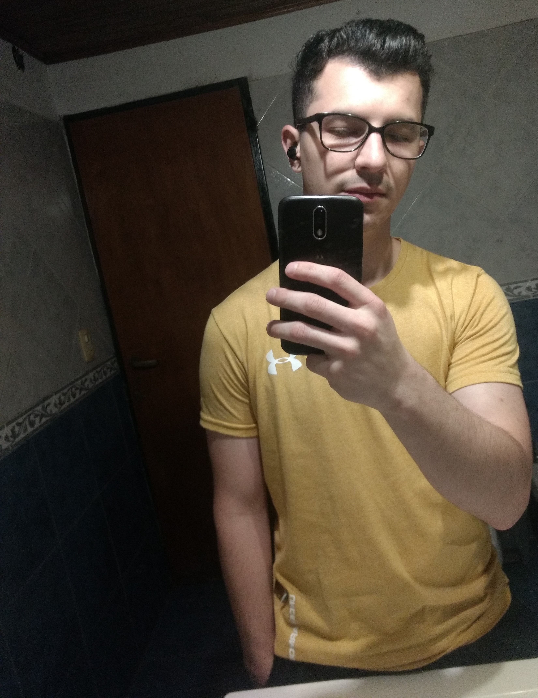

# Johann Gustavo Adam

¡Hola, gente! ¿Como estan? Me presento, me llamo Johann, soy estudiante de la Universidad Nacional de Hurlingham (UNAHUR) desde 2020 (Si arranque en la pandemia ajaja) y es mi primera vez en esta materia de programación orientación a objetos, me costo mucho llegar pero se pudo. Ya había cursado antes cosas relacionadas a esta materia, por ejemplo, el programa que enseña a programar desde cero de parte del gobierno llamado Argentina Programa, la verdad se aprende muy bien ahí y sirve demasiado si estas cursando programación Estructurada o aún mejor, esta materia de Programación con Objetos I y también calculo que debe ayudar Programación con Objetos II (Desconozco los temas que se van a ver pero los cursos de parte del gobierno eran muy completos).
Actualmente estoy estudiando la carrera Tecnicatura Universitaria en Programación y trabajando en una librería en Ituzaingó, ambos me mantienen bien cuidado al final del día, el estudio y trabajar a la par no parece tan bueno a veces pero en mi caso, me encanta.

Me manejo muy bien trabajando en equipo, en trabajo o para tareas grupales de la universidad. Me gusta que quieran tratar de meternos más en lo que es el trabajo grupal o en equipo, nos va a servir bastante para nuestra labor para cuando consigamos trabajo de lo que estudiamos hoy en día y en otras circunstancias de la vida también. Me gusta la música, muchísimo cuando hago las guías de programación ajaja, también los juegos como tipo hobbie para relajar para un día largo, me gusta salir a tomar café o alguna otra bebida, con amigos o compañeros.

Y nada, creo que esto por ahora, gente. Esta cursada se me es extraña pero le voy a meter ganas, les deseo una muy buena cursada a todos y todas, gracias! 

